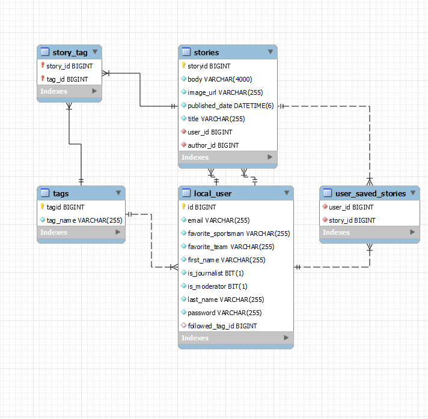

# Sports News Application

## Introduction
The Sports News Application is a meticulously crafted online platform designed to serve the latest and most compelling sports news to enthusiasts around the globe. This project, conceived for a Software Design course, goes beyond traditional news delivery; it engages users with personalized content, interactive features, and an immersive sports journalism experience covering MMA, Formula 1, Soccer, and Basketball.

## Features

### User Registration and Engagement
Users register to unlock customized news feeds, interact with stories through likes and shares, save articles for later, and subscribe to a newsletter for regular updates, making the sports news experience deeply personal and engaging.

### Journalist Integration
A specialized interface for journalists, enabled by moderator approval, allows for the publication of articles directly to the platform. This feature ensures a continuous stream of professional content, enriching the platform's diversity and depth.

### Advanced Search Functionality
A powerful search bar supports complex queries, enabling users to find stories by title, tags, or content, ensuring that no story of interest is ever more than a few clicks away.

### Tagging System
A dynamic tagging system categorizes stories with specific sports, teams, athletes, or events, like #LewisHamilton, #ConorMcGregor, or #JoshuaVSFury, facilitating targeted content discovery and navigation.

### Personalized News Feed
Users can tailor their news feed by following favorite teams or athletes, creating a personalized space within the platform that caters exclusively to their preferences.

## Technology Stack

### Backend
**Java**: The choice of Java as the programming language is strategic, leveraging its object-oriented capabilities, robust standard libraries, and widespread community support to build a solid, scalable backend.

### Framework
**Spring Boot**: With Spring Boot, the application enjoys the benefits of rapid development, auto-configuration, and a wide array of starters that simplify database interactions, security, and more.

### Database
**MySQL**: For data storage, MySQL offers a reliable, efficient solution. It's used to manage user profiles, story archives, and the complex relationships between tags, stories, and user preferences.

## Technical Architecture

### RESTful API Design
The backend is structured around a RESTful architecture, offering a set of well-defined APIs for frontend interaction, story submission, user management, and more, ensuring a decoupled, scalable application structure.

##### Get All Users
- **GET** `/users`
  - Retrieves a list of all users.

##### Get User by ID
- **GET** `/users/{id}`
  - Retrieves a single user by their ID.
  - Path Variable: `id` - The ID of the user.

##### Create User
- **POST** `/users`
  - Creates a new user.
  - Request Body: JSON representation of `LocalUser`.

##### Update User
- **PUT** `/users/{id}`
  - Updates an existing user by their ID.
  - Path Variable: `id` - The ID of the user to update.
  - Request Body: JSON representation of `LocalUser` with updated fields.

##### Update User's Favorite Tag
- **PUT** `/users/{userId}/favoriteTag/{tagId}`
  - Updates the user's favorite tag.
  - Path Variables:
    - `userId` - The ID of the user.
    - `tagId` - The ID of the tag to set as favorite.

##### Delete User
- **DELETE** `/users/{id}`
  - Deletes a user by their ID.
  - Path Variable: `id` - The ID of the user to delete.

##### Get All Stories
- **GET** `/stories`
  - Retrieves a list of all stories.

##### Get Story by ID
- **GET** `/stories/{id}`
  - Retrieves a single story by its ID.
  - Path Variable: `id` - The ID of the story.

##### Create Story
- **POST** `/stories`
  - Creates a new story.
  - Request Body: JSON representation of `StoryCreationDTO`.

##### Update Story
- **PUT** `/stories/{id}`
  - Updates an existing story by its ID.
  - Path Variable: `id` - The ID of the story to update.
  - Request Body: JSON representation of `StoryUpdateDTO`.

##### Delete Story
- **DELETE** `/stories/{id}`
  - Deletes a story by its ID.
  - Path Variable: `id` - The ID of the story to delete.

### Entity-Relationship Model
The database schema is designed to support complex relationships:
- **Users** have roles, preferences, and can save or like multiple stories.
- **Stories** are associated with multiple tags and can be authored by a single journalist.
- **Tags** categorize stories for efficient discovery.

### Database Diagram 

### Notification System
A custom notification service leverages Spring's event-driven capabilities to alert users of new stories in their areas of interest, enhancing user engagement.

### Search Functionality
Incorporating Spring Data JPA and Hibernate Search, the application provides advanced search capabilities. It indexes stories for full-text searching, allowing users to find content based on titles, tags, and textual content within stories.

## Conclusion
The Sports News Application stands as a testament to modern software design principles, offering a rich, user-centered experience backed by a robust, scalable technology stack. It promises to be a vibrant platform for sports enthusiasts and journalists alike, bringing the latest sports narratives to a global audience with precision and flair.
